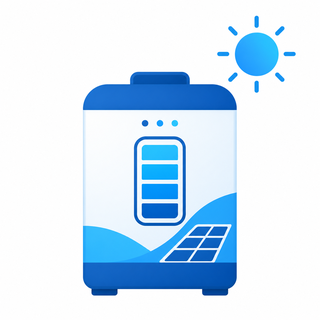

# ioBroker.bluetti

**Read-only ioBroker adapter for [BLUETTI](https://www.bluettipower.com) power stations — battery, solar, grid and load telemetry from the BLUETTI cloud.**

<!-- Badges removed until adapter is in ioBroker repository (#81) -->
<!--  -->
<!--  -->

---

Bring your BLUETTI power station's live data into ioBroker: state of charge, PV/grid input and AC/DC output power, plus connection and health indicators for UPS-style automations. Authentication uses the same BLUETTI cloud login as the official Home Assistant integration — no app passwords, no scraping.

> **Status:** working and verified end-to-end against a live BLUETTI account (Elite 30 V2) on js-controller 7.0.7. Not yet published to the ioBroker repositories. The core telemetry is stable; richer per-model telemetry is still being validated against real payloads.

## ✨ Features

- 🔋 **Battery & power telemetry** — state of charge, PV input, grid input, AC/DC output power
- 🔐 **Secure cloud login** — BLUETTI OAuth with built-in credentials; the token is stored encrypted and refreshed automatically
- 🔎 **Device discovery** — pick your device from a list after login
- 🩺 **Health & connection states** — reachability, consecutive failures and a conservative outage-suspicion signal for UPS automations
- 👀 **Read-only & safe** — the adapter never writes to your device (no mode/AC/DC/firmware changes)

## 🔌 Supported devices

| Model | Product codes | Status |
|---|---|---|
| BLUETTI Elite 30 V2 | `EL30V2`, `PR30V2` | ✅ Verified |

Other BLUETTI models that expose the same cloud API are likely to work but are not yet validated. Sanitized real-world payloads are welcome to help extend support.

## 📦 Requirements

- ioBroker with **js-controller ≥ 6.0.11** and **admin ≥ 7.6.20**
- A BLUETTI account with your device bound in the BLUETTI app
- The device connected to the BLUETTI cloud (online in the app)

## 🚀 Installation & setup

1. Install the adapter and create a `bluetti.0` instance.
2. Open the instance configuration in ioBroker Admin.
3. Click **Authenticate with BLUETTI** and complete the login in the browser window that opens. The adapter uses its built-in BLUETTI client credentials, so no client ID/secret fields are shown in the admin UI.
4. Pick your device from the **device selector**.
5. **Save.** Polling starts automatically; `info.connection` turns `true` once the first poll succeeds.

You only authenticate once — the token is kept encrypted in the `auth.tokenJson` state and refreshed in the background.

If you need to override the built-in client credentials for expert/debug use, edit the instance's native object directly in ioBroker. The adapter still falls back to its shipped defaults when those native values are empty.

## 📊 Objects & states

All states are **read-only**.

### `info`
| State | Type | Description |
|---|---|---|
| `info.connection` | `boolean` | True when authenticated and a selected device returns usable data |

### `device`
| State | Type | Description |
|---|---|---|
| `device.serial` | `string` | Device serial number |
| `device.model` | `string` | Device model |
| `device.name` | `string` | Device name |
| `device.online` | `boolean` | Whether the device is online in the BLUETTI cloud |
| `device.workMode` | `string` | Current working mode as reported by the device (raw enum, e.g. `workmode_3`) |

### `battery`
| State | Type | Description |
|---|---|---|
| `battery.soc` | `number %` | Battery state of charge |
| `battery.dischargeRemaining` | `number min` | Estimated minutes until empty at the current load |
| `battery.chargeRemaining` | `number min` | Estimated minutes until fully charged; 0 when not charging |

### `power`
| State | Type | Description |
|---|---|---|
| `power.pvInput` | `number W` | Photovoltaic (solar) input power |
| `power.gridInput` | `number W` | Grid input power |
| `power.acOutput` | `number W` | AC output (load) power |
| `power.dcOutput` | `number W` | DC output (load) power |
| `power.acOutputActive` | `boolean` | Whether the AC output is currently switched on |
| `power.dcOutputActive` | `boolean` | Whether the DC output is currently switched on |
| `power.acEco` | `boolean` | Whether AC ECO power-saving mode is enabled |
| `power.dcEco` | `boolean` | Whether DC ECO power-saving mode is enabled |

### `health`
| State | Type | Description |
|---|---|---|
| `health.outageSuspected` | `boolean` | Conservative outage-suspicion trigger |
| `health.consecutiveFailures` | `number` | Consecutive polling failures |
| `health.authFailed` | `boolean` | Whether the last failure was an authentication problem |

### `status`
| State | Type | Description |
|---|---|---|
| `status.lastUpdate` | `string` | Timestamp of the last successful poll |
| `status.lastError` | `string` | Last sanitized error message |

## ⚙️ Configuration

| Option | Default | Description |
|---|---|---|
| Poll interval | `300 s` | How often the BLUETTI cloud is polled for fresh telemetry |
| OAuth client ID / secret | built in | Not exposed in Admin; expert overrides remain available via direct native-object edit |

## ⚠️ Cloud dependency & UPS caveat

This adapter reads from the **BLUETTI cloud**, so it depends on your internet connection and BLUETTI's servers being reachable.

A cloud-only adapter **cannot prove a grid outage on its own**. It can only expose evidence — stale telemetry, cloud/device reachability, and repeated polling failures. For reliable power-outage automations, combine these states with at least one **local** signal, such as a router/ping check, a smart meter, a Shelly/energy meter, or a dedicated UPS signal.

## 🛠️ Development

The adapter is a TypeScript, class-based ioBroker adapter with a JSON admin config, scaffolded with `@iobroker/create-adapter`.

| Script | Purpose |
|---|---|
| `npm run build` | Compile TypeScript sources |
| `npm run check` | Type-check without emitting |
| `npm run lint` | Run ESLint |
| `npm test` | Run unit and package tests |
| `npm run test:integration` | Run the ioBroker startup integration test |
| `npm run test:repo` | Run the ioBroker repository checker locally |

Architecture and research notes:

- [BLUETTI Home Assistant API notes](docs/research/bluetti-ha-api-notes.md) — source-backed upstream OAuth, token, device and telemetry findings.
- [Auth, token and device-selection flow](docs/auth-flow.md) — the OAuth/token/device architecture, with the current implementation status noted at the top.

> Until the adapter is published and tagged, `npm run test:repo` reports expected pre-release findings (package not on npm, release not tagged, adapter not yet in the ioBroker repository).

## Changelog

<!-- markdownlint-disable-next-line MD024 -->
### 0.0.1

- Initial release: BLUETTI cloud OAuth login, device discovery/selection, and read-only telemetry polling for the Elite 30 V2.
- Added verified Elite 30 V2 telemetry from a real `deviceStates` payload: battery discharge/charge time remaining, AC/DC output and ECO status, and working mode.

Older entries are kept in [CHANGELOG_OLD.md](CHANGELOG_OLD.md).

## License

MIT License

Copyright (c) 2026 Percy2Live
